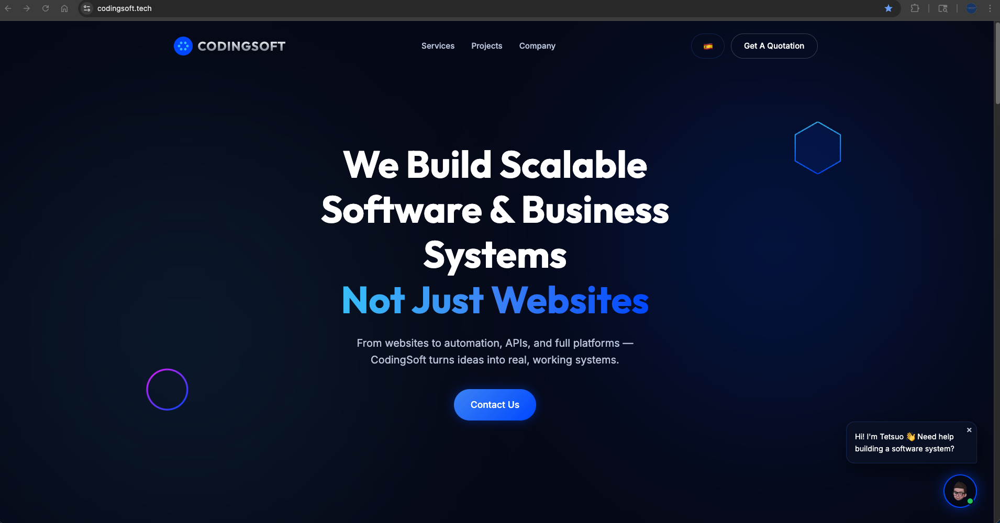

# CodingSoft 🚀

CodingSoft is a modern software solutions website built to showcase custom software development, business automation, web applications, and system integration services.

🌐 **Live Demo:** https://codingsoft.tech

## 📸 Preview

## Overview

CodingSoft helps businesses move beyond basic websites by creating scalable software systems, automation tools, dashboards, APIs, and digital platforms.

This project was built as a professional company landing page with a modern SaaS-style design.

## 🎯 Impact

- Designed to convert visitors into potential clients through chatbot interaction
- Built as a foundation for a scalable SaaS platform (CodingSoft ecosystem)
- Targets real-world business use cases (SPAs, restaurants, service businesses)

## Features

- Modern responsive landing page
- Dark theme with cobalt blue branding
- EN/ES language toggle
- Automated chatbot widget
- Social media integration
- Smooth animations and interactive sections
- Custom domain deployment

## 🛠️ Tech Stack

**Frontend:** HTML, CSS, JavaScript  
**Deployment:** GitHub Pages  
**Domain:** Custom domain (CNAME configuration)

## Key Sections

- Hero section
- Services
- Projects
- Why Choose Us
- FAQ
- CTA
- Footer with social links
- Chatbot assistant

## 🧠 Engineering Takeaways

- Building a modern production-ready landing page
- Managing deployment with GitHub Pages
- Implementing multilingual UI behavior
- Creating chatbot-style user interaction
- Improving UI/UX through iterative design

## Future Improvements

- Connect chatbot to backend API
- Store leads in a database
- Add analytics
- Add payment/booking integrations
- Expand CodingSoft into a SaaS platform

## 🚀 Future Vision

- Convert CodingSoft into a full SaaS platform
- Implement backend services (Node.js / APIs)
- Add authentication and user dashboards
- Integrate payment systems (Stripe)
- Enable multi-client system architecture

## Architecture Notes

- Built as a static frontend deployed via GitHub Pages
- Designed for future backend integration (chatbot → API)
- Modular JS structure (main.js, chat.js, translations.js)
- Scalable UI structure for SaaS evolution

