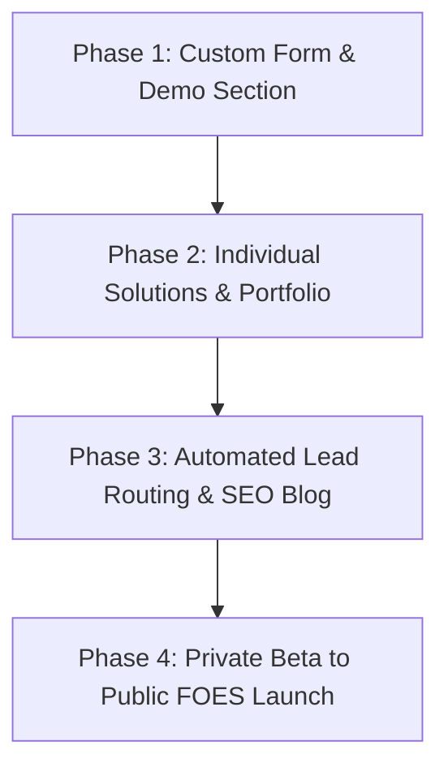

# CodingSoft Technology Website — Project Context & Implementation Plan

## 1. Project Purpose
CodingSoft Technology is the main commercial website for custom services:
- Websites
- Automation
- Business systems
- Dashboards
- Custom web apps
- SaaS MVP/platform development

The primary goal of the website is to capture, qualify, and convert visitors into leads for these custom services.

---

## 2. Current Positioning
The messaging focuses on delivering professional, robust, and clean technology solutions tailored for business operations.

### Taglines
* **English:** Websites. Automation. Business Systems.
* **Spanish:** Sitios web. Automatización. Sistemas empresariales.

### Supporting Message
* **English:** We build modern websites, automation workflows, and business systems that help companies operate, grow, and convert more customers.
* **Spanish:** Creamos sitios web modernos, automatización y sistemas empresariales que ayudan a las empresas a operar, crecer y convertir más clientes.

---

## 3. CodingSoft vs FOES Separation
* **CodingSoft Technology** is the customer-facing agency and custom services company website.
* **FOES** is an independent SaaS product currently under development. It must **NOT** be promoted or mentioned anywhere on the public CodingSoft site (including the homepage, forms, and pages) yet.
* Public promotion of FOES will only start after the following conditions are met:
  1. The dedicated FOES landing page is designed and approved.
  2. The product beta testing phase is successfully completed.
  3. Stripe integration and merchant accounts are configured.
  4. Packaging tiers and final pricing structures are locked in.

---

## 4. Current Website Structure
The site operates as a performant, bilingual static application with the following components:
* **Home Page (`index.html`):** Introducing core services, agency positioning, why choose us, the client process, and FAQs.
* **Services Section:** Highlights automation workflows, custom websites, dashboards, and API integrations.
* **Projects Section:** Displays cards representing recent custom solutions and client work.
* **Company Section:** Focuses on the core business ethos ("Technology Built for Real Businesses").
* **Start Project Form (`/start-project/`):** The custom multi-locale request form to capture user inputs.
* **Bilingual Language Switcher:** A dynamic localizer that switches the UI language seamlessly between English (`en`) and Spanish (`es`) using translations mapped in `translations.js`.
* **Footer:** Contains unified branding, quick links, policies, and localized tags.
* **Chat Widget (`chat.js`):** Interactive floating assistant for user inquiries and automated lead capture.

---

## 5. Homepage Section: Industry Website Solutions
Located on the homepage, positioned between the Hero section and "Why Choose Us".

### Purpose
To show visitors that CodingSoft offers ready-to-customize website demos for specific industries.

### Initial Industry Cards
1. **Real Estate Websites**
2. **Construction Websites**
3. **Restaurant Websites**
4. **Cleaning Services Websites**
5. **Logistics Websites**

### Card Features & CTA Rules
Each card consists of:
* **Industry Icon:** Custom responsive SVG icon.
* **Short Description:** Outlining target benefits for the specific sector (localized).
* **View Demo Button:** Opens the live demo if ready. If the demo is not ready, it shows a "Coming Soon" label with a styled disabled (`btn-disabled`) look.
* **Request This Website Button:** Routes users directly to the pre-populated project inquiry page at `/start-project/?industry=[slug]`.

---

## 6. Real Estate Demo Integration
* The Real Estate demo is built and hosted as a separate project: `codingsoft-demo-real-estate`.
* **View Demo Link:** Once fully deployed, the "View Demo" button on the Real Estate card will point to the Vercel deployment URL or a future custom subdomain (`realestate.codingsoft.tech`).
* **Request Button Link:** Will navigate to `/start-project/?industry=real-estate`.

---

## 7. Start Project Form Routing
The Start Project page (`/start-project/`) dynamically parses URL parameters to pre-select fields.
* **Supported slugs:** `real-estate`, `construction`, `restaurant`, `cleaning`, `logistics`.
* **Behavior:** When a URL like `/start-project/?industry=real-estate` is loaded:
  * The **Industry** dropdown automatically pre-selects: `Real Estate`.
  * The **Service Needed** dropdown automatically pre-selects: `Real Estate Website` (or the industry's default service profile).

---

## 8. Start Project Form Fields
The project inquiry form gathers the following details:
1. **Full Name** (`name`)
2. **Business Name** (`business`)
3. **Email Address** (`email`)
4. **Phone Number** (`phone`)
5. **Industry** (`industry`)
6. **Project Type / Service Needed** (`service`)
7. **Estimated Project Budget** (`budget`)
8. **Timeline** (`timeline`)
9. **Project Details & Message** (`message`)

---

## 9. Project Type Options
Dropdown options for the **Service Needed** select element:

### English Options
* Landing Page
* Business Website
* Website + SEO
* Automation
* Business Dashboard
* Custom Web App
* SaaS MVP / Platform
* Not sure yet

### Spanish Options
* Landing Page
* Sitio web empresarial
* Sitio web + SEO
* Automatización
* Dashboard de negocio
* Aplicación web personalizada
* MVP SaaS / Plataforma
* Aún no estoy seguro

---

## 10. Estimated Project Budget
The selector is named "Estimated Project Budget" (*Presupuesto estimado del proyecto*).

### Helper Text
* **English:** This helps us recommend the right scope or MVP path. Final pricing is estimated and depends on project requirements.
* **Spanish:** Esto nos ayuda a recomendar el alcance correcto o un camino MVP. El precio final es estimado y depende de los requisitos del proyecto.

### Options
| Key | English Value | Spanish Value |
| :--- | :--- | :--- |
| `under-2500` | Under $2,500 | Menos de $2,500 |
| `2500-5000` | $2,500 – $5,000 | $2,500 – $5,000 |
| `5000-10000` | $5,000 – $10,000 | $5,000 – $10,000 |
| `10000-25000` | $10,000 – $25,000 | $10,000 – $25,000 |
| `25000-50000` | $25,000 – $50,000 | $25,000 – $50,000 |
| `50000-plus` | $50,000+ | $50,000+ |
| `not-sure-budget` | Not sure yet | Aún no estoy seguro |

---

## 11. SaaS Budget Helper Logic
When a user selects **SaaS MVP / Platform** (`saas-mvp`) and sets the budget to **under $10,000** (`under-2500`, `2500-5000`, or `5000-10000`), a non-blocking educational warning box is shown.

### Banner Copy
* **English:** SaaS platforms usually require a larger investment than a standard website. A lean SaaS MVP can start around $12,000–$18,000 when the scope is limited to one core workflow, basic authentication, and a simple database. Standard SaaS MVPs with payments, dashboards, roles, and multiple features commonly range from $18,000–$35,000+. AI, integrations, multi-tenant architecture, or advanced automation can increase the scope to $35,000–$60,000+. You can still submit your idea, and we’ll recommend a realistic MVP path.
* **Spanish:** Las plataformas SaaS normalmente requieren una inversión mayor que un sitio web estándar. Un MVP SaaS lean puede empezar alrededor de $12,000–$18,000 cuando el alcance se limita a un flujo principal, autenticación básica y una base de datos simple. Un MVP SaaS estándar con pagos, dashboards, roles y múltiples funciones normalmente está entre $18,000–$35,000+. IA, integraciones, arquitectura multi-tenant o automatización avanzada pueden elevar el alcance a $35,000–$60,000+. Igual puedes enviar tu idea y te recomendaremos un camino MVP realista.

---

## 12. Urgent Timeline Helper Logic
If the user selects **Urgent (Less than 2 weeks)** (`urgent`) from the timeline selector, a helper message is displayed under the dropdown:
* **English:** Urgent timelines may require a reduced scope or rush pricing.
* **Spanish:** Los plazos urgentes pueden requerir reducir el alcance o aplicar precio de prioridad.

---

## 13. Bilingual Requirements
* The site must translate all content comprehensively between English (`en`) and Spanish (`es`).
* All copy additions, options, buttons, and helper banners must have corresponding translation keys mapped in `translations.js`.
* Under no circumstances should hardcoded strings exist inside pages. Always use `data-i18n` attributes.

---

## 14. CTA Rules
### Primary CTA
* **Get A Quotation / Pedir Presupuesto:** Routes users directly to the Start Project page.

### Secondary CTAs
* **View Demo / Ver Demo:** Opens a specific industry demo site.
* **Request This Website / Solicitar Este Sitio Web:** Pre-populates the inquiry form.
* **Start Your Project / Comienza Tu Proyecto:** Leads to the general inquiry form.
* **Schedule a Demo / Agendar Demo:** Dynamic link to schedule a discovery call.

*Note: All service-related inquiry CTAs must route to `start-project` paths rather than any internal FOES targets.*

---

## 15. Email / Lead Handling
Submissions must eventually route to: `contact@codingsoft.tech`.
### Implementation Strategy for Static Pages
For a static GitHub Pages environment, select one of the following:
* **EmailJS:** Simple direct client-side integration (fastest MVP setup).
* **Resend / Serverless Functions:** Secure, custom API route via Vercel/Netlify.
* **Custom SMTP / Backend:** Set up standard email gateways if migrating to a server-side app framework.

---

## 16. Design Direction
Maintains the existing modern, premium dark SaaS aesthetic:
* **Color Palette:** Deep cobalt and navy backgrounds, sleek neon blue gradients, contrasting white headers, and muted text colors.
* **Layout Elements:** Glassmorphism card backdrops, glowing borders, smooth hover animations (`translateY(-5px)` or scale), high color contrasts, clean fonts (Inter/Outfit), and absolute mobile responsiveness.

---

## 17. SEO Goals
Optimize tags and layout to rank for keywords:
* Custom websites for small businesses
* Business automation services
* custom web app development
* SaaS MVP development
* website design for realtors
* website design for construction companies
* restaurant website design
* cleaning service website design
* logistics website development

---

## 18. Implementation Phases

### Phase 1: Core Foundation (Current)
* Finalize the bilingual `/start-project/` page.
* Implement custom selects, helper texts, and SaaS warning boxes.
* Deploy the **Industry Website Solutions** section.
* Link deployed Real Estate demos.

### Phase 2: Expanded Reach
* Create `/solutions` overview and deep-dive subpages.
* Showcase custom case studies and live client portfolio screens.
* Prepare restaurant, construction, and logistics demos.

### Phase 3: Operations & Growth
* Secure client-side EmailJS integration.
* Embed analytics, conversion tracking, and structured schema markup.
* Launch the bilingual technical blog.

### Phase 4: Product Launch
* De-restrict FOES product mentions.
* Add pricing blocks, Stripe checkouts, and landing pages for the FOES SaaS.

---

## 19. Quality Checklist
Prior to pushing updates live:
* [ ] Verify mobile responsiveness on small screens.
* [ ] Check language toggles; ensure no text breaks boundaries.
* [ ] Test query parameter pre-population (`?industry=...`).
* [ ] Confirm no mentions of "FOES" exist on public client-facing routes.
* [ ] Double-check all external anchor tags (`href`) to avoid dead/broken links.
* [ ] Ensure color contrast ratios meet WCAG accessibility standards.

---

## 20. Claude Review Request
When reviewing this project architecture, analyze the scope as a:
1. **Software Architect:** Assess modularity, clean translation mapping, and static scalability.
2. **CTO:** Assess technical debt (EmailJS vs serverless API, maintenance overhead).
3. **SaaS Product Strategist:** Analyze the isolation/packaging approach of the custom service side vs FOES.
4. **UI/UX Designer:** Evaluate glassmorphism consistency, warning message aesthetics, and conversion friction.
5. **Marketing Strategist:** Identify SEO keyword integration opportunities and conversion optimization paths.

---

## 21. Technical Implementation Cleanups (Phase 1)
To ensure long-term codebase scalability and security, the following technical cleanups were implemented in Phase 1:

### Centralized Industry Configuration
A centralized configuration file `industries.config.js` in the project root defines all custom properties for each supported industry card and option (slug, labels, icons, default services, request and live URLs, and release status).
* **Single Source of Truth:** Home page solutions cards, project page links, the "Start Project" form dropdown, and the URL parameters query parser read from this file directly.
* **Localization:** Card titles and descriptions translate dynamically via code using the config's `labelEn`/`labelEs` and `descEn`/`descEs` parameters when switching the site language.

### Robust Query Parameter Fallback
If an unrecognized or invalid slug is passed to the start project page (e.g. `/start-project/?industry=invalid-slug`):
* **Fail-Safe Mechanism:** The page does not throw errors or break. The dropdown selectors are safely kept blank.
* **Friendly Notification:** A warning banner is displayed alerting the user in their active language: *"We could not recognize that industry. Please select the best option below."*

### Honeypot Anti-Spam Security
* **Implementation:** A hidden honeypot input field (`website_confirm`) with strict CSS styling (`display: none; visibility: hidden;`) and keyboard indexing disabled (`tabindex="-1`) is added inside the form markup to block automated bots.
* **Spam Catching:** If a submission fills in the honeypot, the handler prevents sending and shows a spam detection error screen instead of faking success.

### Email Delivery Integration (EmailJS)
* **SDK Connection:** Integrated EmailJS browser SDK (via CDN) to route project inquiry submissions directly to `contact@codingsoft.tech` (managed via service `service_5639krm`).
* **Complete Field Mapping:** Form submissions send 11 mapped parameters including user details, project selection, page URL, and user language.
* **Error Handling & Configurations:** If the template ID is unconfigured, a clear developer warning is logged, and a user-friendly configuration message is rendered. Submission failures show a retry-friendly error card rather than fake successes.

### FOES Mention Protection Checks
* **Local Alert Trigger:** Built-in dev check blocks within both `main.js` and `start-project/index.html` scan the text contents of the document on localhost environments.
* **Protection Goal:** Throws a developer warning in the console if case-insensitive string "FOES" is detected on the page, preventing premature leakage of the SaaS brand name on public agency pages.

### Educational Pricing Qualification Banners
* **Implementation:** Trigger-matrix logic checks the combination of the selected service, budget, and timeline to dynamically display relevant educational warning banners. Only one warning is shown at a time based on a priority queue (urgent complex service takes precedence). Refer to full specifications in [banners-pricing-qualification-i18n.md](file:///Users/oscarmg/Desktop/codingsoft.github.io/docs/banners-pricing-qualification-i18n.md).
